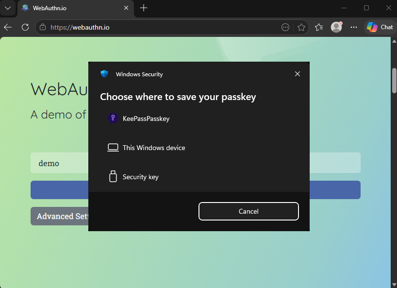
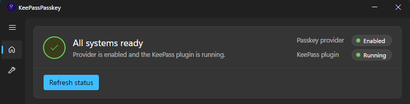

# KeePassPasskey

[](https://github.com/yusei36/KeePassPasskey) [](https://github.com/yusei36/KeePassPasskey/releases/latest) [](https://github.com/yusei36/KeePassPasskey/releases/latest)

**[Download](https://github.com/yusei36/KeePassPasskey/releases/latest)** | **[Installation](#installation)** | **[User Guide](docs/user-guide.md)** | **[FAQ & Troubleshooting](docs/troubleshooting-faq.md)**

A KeePass plugin that turns KeePass into a native Windows 11 passkey provider. Websites and apps that support passkeys work automatically - no browser extension required.



## Requirements

- [KeePass](https://keepass.info/) 2.54 or later
- Windows 11 24H2 or later, with TPM[*](docs/troubleshooting-faq.md#why-is-a-tpm-required) enabled

## How it works

Windows 11 routes passkey operations through a COM server registered as a plugin authenticator. This project implements that COM server and a KeePass plugin that handles the actual cryptography:

```
          Browser
             ↕  (Windows WebAuthn API)
          Windows
             ↕  (COM)
KeePassPasskeyProvider.exe
             ↕  (Named pipe)
    KeePassPasskey.dll
             ↕  (KeePass entry)
     KeePass Database
```

- **KeePassPasskeyProvider.exe** - COM server, MSIX-packaged, handles the Windows WebAuthn API surface and credential cache sync
- **KeePassPasskey.dll** - KeePass plugin, handles key generation and signing, stores credentials in the open database
- Credentials are stored in KeePassXC-compatible `KPEX_PASSKEY_*` fields, so they are readable by KeePassXC and vice versa

## Installation

### Option A - automatic (recommended)

1. Download `KeePassPasskey-<version>.zip` from the [releases page](https://github.com/yusei36/KeePassPasskey/releases) and extract it.
2. Copy the `KeePassPasskeyPlugin` folder to your KeePass `Plugins` folder (e.g. `C:\Program Files\KeePass Password Safe 2\Plugins\`) and (re)start KeePass.
3. Run `InstallMsix.bat` as Administrator, it trusts the included certificate, installs the MSIX, and starts the **KeePassPasskey** provider app.
4. Click **Advanced Passkey Options** in the app and enable **KeePassPasskey**.
5. Both status indicators in the **KeePassPasskey** app should show green.



### Option B - manual

1. Download `KeePassPasskey-<version>.zip` from the [releases page](https://github.com/yusei36/KeePassPasskey/releases) and extract it.
2. Copy the `KeePassPasskeyPlugin` folder to your KeePass `Plugins` folder (e.g. `C:\Program Files\KeePass Password Safe 2\Plugins\`) and (re)start KeePass.
3. Trust the certificate: right-click `KeePassPasskey.cer` → **Install Certificate** → **Local Machine** → place it in the **Trusted People** store.
4. Install the MSIX: double-click `KeePassPasskeyProvider.Package_<version>_x64.msix` and click **Install**.
5. Launch **KeePassPasskey** from the Start menu, click **Advanced Passkey Options** in the app and enable **KeePassPasskey**.
6. Both status indicators in the **KeePassPasskey** app should show green.
7. (Optional) Remove the certificate: open **certlm.msc** → **Trusted People** → **Certificates**, find **KeePassPasskey**, and delete it. The certificate is only needed during installation.

Once installed, see the [User Guide](docs/user-guide.md) to get started.

## Credential storage

Passkeys are stored as standard KeePass entries using [KeePassXC's passkey field format](https://github.com/keepassxreboot/keepassxc):

| Field | Content |
|---|---|
| `KPEX_PASSKEY_CREDENTIAL_ID` | Base64url credential ID |
| `KPEX_PASSKEY_PRIVATE_KEY_PEM` | PKCS#8 private key (PEM) |
| `KPEX_PASSKEY_RELYING_PARTY` | Relying party ID (e.g. `github.com`) |
| `KPEX_PASSKEY_USERNAME` | User name from registration |
| `KPEX_PASSKEY_USER_HANDLE` | Base64url user handle |
| `KPEX_PASSKEY_FLAG_BE` | Backup Eligibility flag, always `1` |
| `KPEX_PASSKEY_FLAG_BS` | Backup State flag, always `1` |

Credentials created here can be read by KeePassXC and vice versa. Three algorithms are supported: **ES256** (EC P-256), **EdDSA** (Ed25519), and **RS256** (RSA-2048). The algorithm is encoded in the PKCS#8 OID and requires no separate field, matching KeePassXC's storage format exactly.

`FLAG_BE` and `FLAG_BS` correspond to bits 3 and 4 of the WebAuthn authenticatorData flags byte. `BE=1` means the credential is eligible to be synced across devices; `BS=1` means it currently is. Both are set to `1` because a KeePass database is typically synced via cloud storage (Dropbox, OneDrive, etc.), making its passkeys genuine synced credentials. Relying parties use these flags to distinguish synced passkeys (`BE=1`) from hardware-bound keys such as a YubiKey (`BE=0`). This matches KeePassXC's behaviour.

## Security

- All signing happens inside KeePass, so private keys are never sent over the pipe.
- The KeePass plugin and the COM server mutually authenticate over the pipe: the plugin verifies the connecting COM server, and the COM server verifies the plugin, before any request is processed. In production (MSIX-installed) this checks the package family name.
- The named pipe is restricted by ACL to the current user at medium integrity, so other users and lower-integrity processes cannot connect.

## Identifiers

| Identifier | Value |
|---|---|
| COM CLSID | `4bff0a65-fdd6-4f97-ac44-7741ecaa5d7e` |
| AAGUID | `9addb28c-b46f-4402-808f-019651441ff3` |

## Project structure

```
src/
  KeePassPasskeyShared/         IPC protocol definitions and shared helpers
  KeePassPasskeyProvider/       COM server (.NET 10, x64)
  KeePassPasskeyPlugin/         KeePass plugin (.NET Framework 4.8)
  KeePassPasskeyProvider.Package/  MSIX packaging (wapproj)
scripts/
  Install-Provider.ps1          Build, sign, and install the provider for local testing (requires elevation)
  Publish-Package.ps1           Build Release, sign, and produce distributable zip
  InstallMsix.bat               End-user MSIX installer (shipped inside the release zip)
```

## Building

### Prerequisites

| Requirement | Notes |
|---|---|
| Visual Studio 2026 | With .NET desktop development workload |
| Windows SDK 10.0.26100.7175+ | Required for wapproj build and code signing |
| .NET 10 SDK | For KeePassPasskeyProvider |
| .NET Framework 4.8 SDK | For KeePassPasskeyPlugin |
| KeePass.exe (2.54, compile reference) | Place at `build\KeePass.exe` - minimum supported version, used only for compilation |
| KeePass.exe (current, for debugging) | Place at `build\KeePass\KeePass.exe` - your installed/current version, used to launch KeePass during development |

```powershell
# Compile-time reference - KeePass 2.54 (minimum supported version)
Copy-Item "path\to\KeePass-2.54\KeePass.exe" build\

# Debug/run target - your current KeePass installation
Copy-Item "C:\Program Files\KeePass Password Safe 2\KeePass.exe" build\KeePass\
```

Then run the build script as Administrator - builds the MSIX, signs it, and installs:

```powershell
.\scripts\Install-Provider.ps1 -Configuration Release
```

Copy the DLLs from `build\Release\` to a `KeePassPasskeyPlugin` folder inside your KeePass `Plugins` folder (e.g. `C:\Program Files\KeePass Password Safe 2\Plugins\KeePassPasskeyPlugin\`) and (re)start KeePass. Then click **Advanced Passkey Options** in the app and enable **KeePassPasskey**.

### Manual registration (CLI alternative)

If auto-registration fails, you can register manually:

```powershell
KeePassPasskeyProvider.exe /register
KeePassPasskeyProvider.exe /status   # verify
```

Then open Settings manually: **Settings → Accounts → Passkeys → Advanced Options** → enable **KeePassPasskey**.

## License

Copyright © 2026 Uwe Kögel

This program is free software: you can redistribute it and/or modify
it under the terms of the GNU General Public License as published by
the Free Software Foundation, either version 3 of the License, or
(at your option) any later version.

This program is distributed in the hope that it will be useful,
but WITHOUT ANY WARRANTY; without even the implied warranty of
MERCHANTABILITY or FITNESS FOR A PARTICULAR PURPOSE. See the
GNU General Public License for more details.

You should have received a copy of the GNU General Public License
along with this program. If not, see <https://www.gnu.org/licenses/>.

See [LICENSE](LICENSE) for the full license text.
