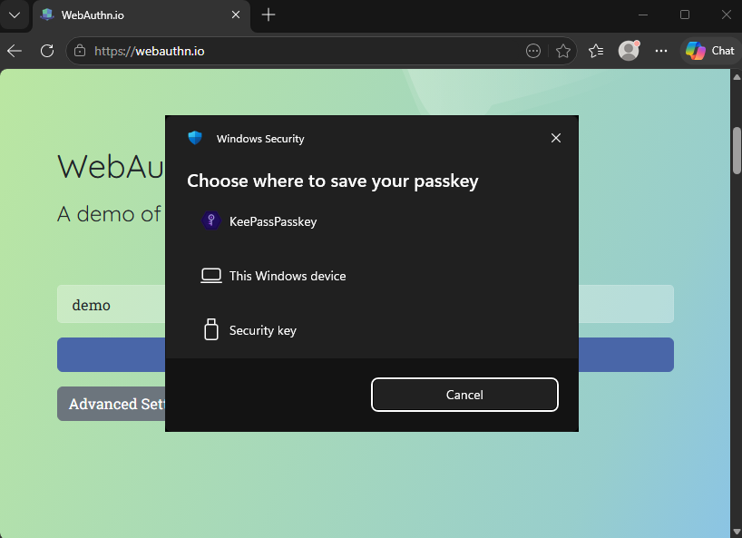
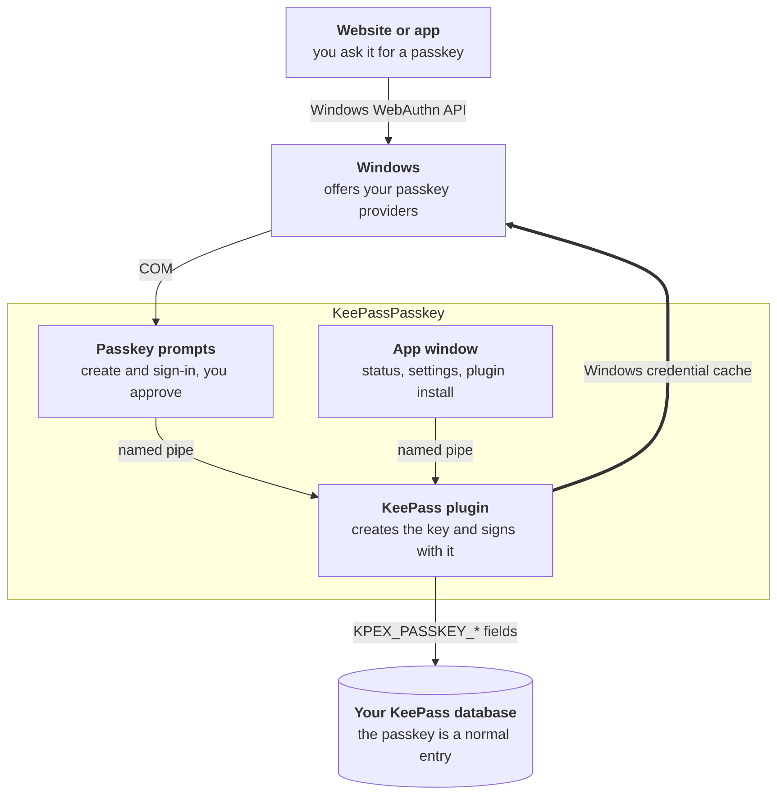
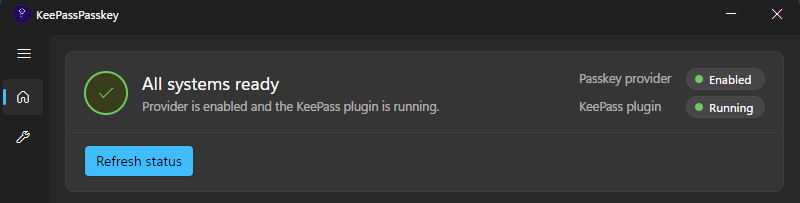

# KeePassPasskey

[](https://github.com/yusei36/KeePassPasskey) [](https://github.com/yusei36/KeePassPasskey/releases/latest) [](https://github.com/yusei36/KeePassPasskey/releases/latest) [](https://apps.microsoft.com/detail/9nwnfhjpspgz?mode=direct)

**[Installation](#installation)** | **[User Guide](docs/user-guide.md)** | **[FAQ & Troubleshooting](docs/troubleshooting-faq.md)**

A KeePass plugin that turns KeePass into a native Windows 11 passkey provider. Websites and apps that support passkeys work automatically - no browser extension required.



## Requirements

- [KeePass](https://keepass.info/) 2.54 or later
- Windows 11 24H2 or later, with TPM[*](docs/troubleshooting-faq.md#why-is-a-tpm-required) enabled

## How it works

When a website asks for a passkey, Windows offers KeePassPasskey as a provider. You approve the request, and the passkey is created in your unlocked KeePass database as an ordinary entry.

<details>
<summary><b>Diagram: where a passkey request goes</b></summary>


```mermaid
%%{init: {'flowchart': {'useMaxWidth': false}}}%%
flowchart TB
    Site["`**Website or app**
you ask it for a passkey`"]
    Win["`**Windows**
offers your passkey providers`"]

    subgraph KPP ["KeePassPasskey"]
        Prompt["`**Passkey prompts**
create and sign-in, you approve`"]
        UI["`**App window**
status, settings, plugin install`"]
        Plug["`**KeePass plugin**
creates the key and signs with it`"]
    end

    DB[("`**Your KeePass database**
the passkey is a normal entry`")]

    Site -->|Windows WebAuthn API| Win
    Win -->|COM| Prompt
    Prompt -->|named pipe| Plug
    UI -->|named pipe| Plug
    Plug -->|KPEX_PASSKEY_* fields| DB
    Plug ==>|Windows credential cache| Win
```

</details>

You meet KeePassPasskey twice: as the prompt you approve during a request, and as the app window you open yourself for status, settings and installing the plugin. Both are the same installed app, started two different ways, and neither runs permanently.

Signing in takes the same path, except that the entry already exists: Windows offers your saved passkeys, you approve, and the key in your database signs the challenge. Every key stays inside your database file, and all cryptography runs locally.

So that Windows can offer your passkeys in its sign-in dialogs, the passkey metadata (site and user name, never the keys themselves) is written to the Windows credential cache as you open or save your database.

Credentials are stored in KeePassXC-compatible `KPEX_PASSKEY_*` fields, so KeePassXC can read them and vice versa.

Under the hood, Windows 11 routes passkey operations through a COM server registered as a plugin authenticator. This project is both sides of that:

- **KeePassPasskeyProvider.exe**: the MSIX-packaged provider. Windows cold-starts it as an out-of-process COM server for each request and it self-exits when idle; the same binary hosts the app window and keeps the Windows credential cache in sync
- **KeePassPasskey.dll**: the KeePass plugin. Generates and uses the keys, and stores them in the open database

## Installation

### Option A - Microsoft Store (recommended)

[](https://apps.microsoft.com/detail/9nwnfhjpspgz?mode=direct)

1. Install [KeePassPasskey](https://apps.microsoft.com/detail/9nwnfhjpspgz) from the Microsoft Store and launch it.
2. Follow the built-in **Setup Guide**: click **Install plugin**, check the detected KeePass folder, and click **Install**. Restart KeePass if it is running. Would rather copy the file yourself? The app can reveal the plugin file in Explorer instead.
3. Continue the Setup Guide to open Windows **Advanced passkey options** and enable **KeePassPasskey**.
4. Both status indicators in the **KeePassPasskey** app should show green.



> [!NOTE]
> The app updates automatically. When it ships a newer plugin, KeePass offers to update it at the next start, see [Updates](docs/user-guide.md#updates).

Once installed, continue with the [User Guide](docs/user-guide.md) to get started.

Prefer the command line? `winget install --name "KeePassPasskey" --source msstore` installs the same package.

### Option B - GitHub install with script

1. Download `KeePassPasskey-<version>.zip` from the [releases page](https://github.com/yusei36/KeePassPasskey/releases) and extract it.
2. Run `InstallMsix.bat` as Administrator, it trusts the included certificate, installs the MSIX, and starts the **KeePassPasskey** provider app.
3. In the app, click **Install plugin**, check the detected KeePass folder, and click **Install**. Restart KeePass if it is running. Would rather copy the file yourself? The app can reveal the plugin file in Explorer instead.
4. Click **Advanced Passkey Options** in the app and enable **KeePassPasskey**.
5. Both status indicators in the **KeePassPasskey** app should show green.

### Option C - GitHub manual installation

1. Download `KeePassPasskey-<version>.zip` from the [releases page](https://github.com/yusei36/KeePassPasskey/releases) and extract it.
2. Trust the certificate: right-click `KeePassPasskey.cer` → **Install Certificate** → **Local Machine** → place it in the **Trusted People** store.
3. Install the MSIX: double-click `KeePassPasskeyProvider.Package_<version>_x64.msix` and click **Install**.
4. Launch **KeePassPasskey** from the Start menu, click **Install plugin**, check the detected KeePass folder, and click **Install**. Restart KeePass if it is running. Would rather copy the file yourself? The app can reveal the plugin file in Explorer instead.
5. Click **Advanced Passkey Options** in the app and enable **KeePassPasskey**.
6. Both status indicators in the **KeePassPasskey** app should show green.
7. (Optional) Remove the certificate: open **certlm.msc** → **Trusted People** → **Certificates**, find **KeePassPasskey**, and delete it. The certificate is only needed during installation.

## Credential storage

Passkeys are stored as standard KeePass entries using [KeePassXC's passkey field format](https://github.com/keepassxreboot/keepassxc):

| Field | Content |
|---|---|
| `KPEX_PASSKEY_CREDENTIAL_ID` | Base64url credential ID |
| `KPEX_PASSKEY_PRIVATE_KEY_PEM` | PKCS#8 private key (PEM) |
| `KPEX_PASSKEY_RELYING_PARTY` | Relying party ID (e.g. `github.com`) |
| `KPEX_PASSKEY_USERNAME` | User name from registration |
| `KPEX_PASSKEY_USER_HANDLE` | Base64url user handle |
| `KPEX_PASSKEY_FLAG_BE` | Backup Eligibility flag (`1`/`0`, default `1`) |
| `KPEX_PASSKEY_FLAG_BS` | Backup State flag (`1`/`0`, default `1`) |

Credentials created here can be read by KeePassXC and vice versa. Three algorithms are supported: **ES256** (EC P-256), **EdDSA** (Ed25519), and **RS256** (RSA-2048). The algorithm is encoded in the PKCS#8 OID and requires no separate field, matching KeePassXC's storage format exactly.

`FLAG_BE` and `FLAG_BS` correspond to bits 3 and 4 of the WebAuthn authenticatorData flags byte. `BE=1` means the credential is eligible to be synced across devices; `BS=1` means it currently is. Both default to `1`, matching KeePassXC's behaviour. The default for new passkeys is configurable and can be overridden per entry, see the [user guide](docs/user-guide.md#expert).

## Security

- All signing happens inside KeePass, so private keys are never sent over the pipe.
- The KeePass plugin verifies the connecting COM server before any request is processed: in production (MSIX-installed) it checks the client's package family name and rejects non-MSIX processes.
- The named pipe is restricted by ACL to the current user at medium integrity, so other users and lower-integrity processes cannot connect.

## AAGUID

The AAGUID tells relying parties which authenticator created a passkey. KeePassPasskey's is:

`9addb28c-b46f-4402-808f-019651441ff3`

## Project structure

```
src/
  KeePassPasskeyShared/         IPC protocol definitions and shared helpers
  KeePassPasskeyProvider/       COM server (.NET 10, x64)
  KeePassPasskeyPlugin/         KeePass plugin (.NET Framework 4.8)
  KeePassPasskeyProvider.Package/  MSIX packaging (wapproj)
scripts/
  Install-Provider.ps1          Build, sign, and install the provider for local testing (requires elevation)
  Publish-Package.ps1           Build Release, sign, and produce distributable zip
  InstallMsix.bat               End-user MSIX installer (shipped inside the release zip)
```

## Building

### Prerequisites

| Requirement | Notes |
|---|---|
| Visual Studio 2026 | With .NET desktop development workload |
| Windows SDK 10.0.26100.7175+ | Required for wapproj build and code signing |
| .NET 10 SDK | For KeePassPasskeyProvider |
| .NET Framework 4.8 SDK | For KeePassPasskeyPlugin |
| KeePass.exe (2.54, compile reference) | Place at `build\KeePass.exe` - minimum supported version, used only for compilation |
| KeePass.exe (current, for debugging) | Place at `build\KeePass\KeePass.exe` - your installed/current version, used to launch KeePass during development |

```powershell
# Compile-time reference - KeePass 2.54 (minimum supported version)
Copy-Item "path\to\KeePass-2.54\KeePass.exe" build\

# Debug/run target - your current KeePass installation
Copy-Item "C:\Program Files\KeePass Password Safe 2\KeePass.exe" build\KeePass\
```

Then run the build script as Administrator - builds the MSIX, signs it, and installs:

```powershell
.\scripts\Install-Provider.ps1 -Configuration Release
```

Copy the DLLs from `build\Release\` to a `KeePassPasskeyPlugin` folder inside your KeePass `Plugins` folder (e.g. `C:\Program Files\KeePass Password Safe 2\Plugins\KeePassPasskeyPlugin\`) and (re)start KeePass. Then click **Advanced Passkey Options** in the app and enable **KeePassPasskey**.

### Manual registration (CLI alternative)

If auto-registration fails, you can register manually:

```powershell
KeePassPasskeyProvider.exe /register
KeePassPasskeyProvider.exe /status   # verify
```

Then open Settings manually: **Settings → Accounts → Passkeys → Advanced Options** → enable **KeePassPasskey**.

## License

Copyright © 2026 Uwe Kögel

This program is free software: you can redistribute it and/or modify
it under the terms of the GNU General Public License as published by
the Free Software Foundation, either version 3 of the License, or
(at your option) any later version.

This program is distributed in the hope that it will be useful,
but WITHOUT ANY WARRANTY; without even the implied warranty of
MERCHANTABILITY or FITNESS FOR A PARTICULAR PURPOSE. See the
GNU General Public License for more details.

You should have received a copy of the GNU General Public License
along with this program. If not, see <https://www.gnu.org/licenses/>.

See [LICENSE](LICENSE) for the full license text.
