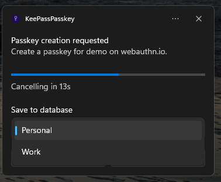

# User Guide

KeePassPasskey turns KeePass into a native Windows 11 passkey provider. Once installed, websites and apps that support passkeys will offer KeePassPasskey as a storage option, and passkeys are saved directly into your KeePass database.

## Requirements

- [KeePass](https://keepass.info/) 2.54 or later
- Windows 11 24H2 or later, with TPM[*](troubleshooting-faq.md#why-is-a-tpm-required) enabled

## Installation

See the [installation instructions in the README](../README.md#installation) for the full setup steps. After installation, both status indicators in the KeePassPasskey app should show green. You can open the app at any time from the Start menu by searching for "KeePassPasskey" to check or adjust the configuration, or for debugging purposes. You do not need to keep it open: the passkey provider runs as a Windows integration in the background and is activated by Windows whenever a passkey operation is requested.

## Updates

Updates are installed the same way as a fresh installation: replace the KeePassPasskey plugin file in your KeePass plugins folder with the new version, then either run `InstallMsix.bat` as an administrator or install the MSIX package. Replacing the plugin file is a manual step, the installer only handles the MSIX and never writes to your KeePass plugins folder. The KeePassPasskey passkey provider in Windows Settings remains enabled from the initial installation and does not need to be re-enabled after an update.

## Creating a passkey

When a website or app asks you to create a passkey, Windows will show a dialog to choose where to save it. KeePassPasskey may not be pre-selected. Follow the steps below.

**Step 1: Click Change to select a different provider**

Windows shows a "Saving your passkey" dialog. If KeePassPasskey is not listed as the destination, click **Change**.

**Step 2: Select KeePassPasskey**

A list of available passkey providers appears. Select **KeePassPasskey**.

**Step 3: Confirm in the KeePassPasskey notification**

A notification from KeePassPasskey appears in the taskbar. Click **Create passkey** to save the passkey to your KeePass database. If more than one KeePass database is unlocked, a database picker appears first. Select the database you want to save to.

At most **5** unlocked databases are offered in this picker. This is a Windows limitation: the notification's selection box cannot hold more than 5 items. If you regularly work with more than 5 databases open, keep only the ones you save passkeys to unlocked.

**Step 4: Passkey saved in KeePass**

The passkey is now stored as an entry in the **Passkeys** group in your open KeePass database.

### Saving a passkey to an existing entry

If you already have an entry for the website (for example your username and password login), KeePassPasskey can save the new passkey **onto that existing entry** instead of creating a separate one, so the passkey lives next to your login.

When matching entries are found, the creation notification shows an extra **Add to existing** button next to **Create passkey**. Choosing it opens a second notification listing the matching entries. The entry you currently have selected in KeePass is listed first and labelled **[selected]**; entries that already hold a passkey are labelled **[overwrite passkey]** (both when applicable: **[selected, overwrite passkey]**). Pick one and confirm to write the passkey onto it.

At most **5** matching entries are offered. This is a Windows limitation: the notification's selection box cannot hold more than 5 items. When more than 5 entries match, the most relevant are shown first: your selected entry, then entries already holding a passkey for this site, then entries matched by their URL.

Matching is by website: an entry qualifies when it already holds a passkey for this site, or when its **URL** field points at the same site (the same domain or a subdomain). If you overwrite an entry that already had a passkey, the previous version is kept in that entry's **History** tab so you can restore it.

This is controlled by the **Offer saving to an existing entry** setting (on by default). Turn it off to always create new entries.

## Signing in with a passkey

KeePassPasskey searches all open databases during sign-in, so you do not need to switch to a particular database first.

### Login with a passkey instead of a password

Some sites let you sign in with a passkey directly, without entering a password. The site may ask for your username first, or offer a dedicated "Sign in with a passkey" button.

**Step 1: Select your passkey from autofill or enter your username**

Click on the username field. The browser may show a list of saved passkeys as autofill suggestions. Select your passkey from the list, or enter your username and click the passkey sign-in option.

**Step 2: Select a passkey (only if multiple are saved for this site)**

If you did not use autofill and have multiple passkeys for this site, Windows shows a list. Select the one you want to use.

**Step 3: Approve in the KeePassPasskey notification**

A KeePassPasskey notification appears in the taskbar. Click **Approve** to confirm.

### Login with a password and passkey as a second factor

Some sites use a passkey as a second factor after you have entered your password.

**Step 1: Enter your username and password**

Enter your username and password as usual and submit the login form.

**Step 2: Select the passkey option as second factor**

When prompted for a second factor, select the passkey option.

**Step 3: Select a passkey (only if multiple are saved for this site)**

If you have multiple passkeys for this site, Windows shows a list. Select the one you want to use.

**Step 4: Approve in the KeePassPasskey notification**

A KeePassPasskey notification appears in the taskbar. Click **Approve** to confirm.

## Managing passkeys in KeePass

Passkeys are stored as standard KeePass entries in the **Passkeys** group.

### Organising passkey entries

Passkey entries can be freely renamed or moved to any group in KeePass without affecting functionality. The **Passkeys** group itself can also be renamed.

If a group has searching disabled in KeePass, passkey entries inside it will not be found by KeePassPasskey.

If multiple entries exist for the same site, KeePassPasskey uses the first one it finds during sign-in. Avoid duplicates by checking the **Passkeys** group before registering again on a site.

### Moving or copying a passkey between entries

You can move or copy the passkey data from one entry to another, for example to attach a passkey to your existing login entry for a site, or to relocate one that was saved to the wrong entry or database. Right-click a passkey entry to open the **Passkey** submenu:

- **Cut Passkey**, then right-click the destination entry and choose **Paste Passkey Here**, moves the passkey. It is removed from the source entry only after the paste succeeds.
- **Copy Passkey**, then **Paste Passkey Here**, duplicates the passkey and leaves it on the source entry. The passkey stays on the clipboard, so you can paste it onto several entries in a row.

This works across open databases: cut or copy in one database, switch to another open database, then paste.

Both entries keep their **History**. The destination entry is backed up before the passkey is written onto it, so if it already held a passkey the previous version can be restored; when moving, the source entry is backed up before its passkey is removed. Pasting onto an entry that already has a passkey asks you to confirm the replacement first. The destination's **URL** and **User name** are filled in only when empty, so any login details you already entered there are preserved.

### Deleting a passkey

To delete a passkey, delete its KeePass entry.

Deleted entries move to the KeePass Recycle Bin, which has searching disabled by default, so KeePassPasskey stops finding the passkey as soon as it lands there. To restore a deleted passkey, move its entry out of the Recycle Bin into another group.

### Passkey entry format

KeePassPasskey identifies an entry as a passkey by the presence of the `KPEX_PASSKEY_CREDENTIAL_ID` and `KPEX_PASSKEY_RELYING_PARTY` fields. An entry without these fields will not be recognised as a passkey, regardless of which group it is in.

Each passkey entry contains these custom fields:

| Field | Content |
|---|---|
| `KPEX_PASSKEY_CREDENTIAL_ID` | Passkey identifier |
| `KPEX_PASSKEY_PRIVATE_KEY_PEM` | Private key (keep this secret) |
| `KPEX_PASSKEY_RELYING_PARTY` | Website domain (e.g. `github.com`) |
| `KPEX_PASSKEY_USERNAME` | Username used during registration |
| `KPEX_PASSKEY_USER_HANDLE` | User identifier from the website |
| `KPEX_PASSKEY_FLAG_BE` | Backup Eligibility flag (`1`/`0`, default `1`) |
| `KPEX_PASSKEY_FLAG_BS` | Backup State flag (`1`/`0`, default `1`) |

Passkeys created by [KeePassXC](https://keepassxc.org/) are stored in the same format and are fully compatible.

## Settings

Open the KeePassPasskey app from the Start menu and navigate to **Settings**.

### Appearance

**Theme**: choose between System (follows Windows), Light, or Dark.

**System tray icon**: when enabled, closing the window keeps the app running in the tray. The passkey provider continues to work regardless of whether the app is open.

### Notifications & User Verification

Controls how KeePassPasskey confirms your identity before completing a passkey operation.

| Option | Behavior |
|---|---|
| Notification | Shows a notification you must approve |
| Windows Hello | Requires Windows Hello (PIN, fingerprint, or face) |
| Both | Requires both a notification approval and Windows Hello (default) |
| None | No confirmation required: passkey operations complete silently |

Separate settings exist for **Registration** (creating a passkey) and **Sign-in** (using a passkey). The **Approval timeout** controls how long the notification stays open before the operation is cancelled (default: 30 seconds). This timeout only applies when the approval mode includes **Notification**.

**Show error notifications**: when enabled, KeePassPasskey shows a detailed notification if a passkey operation fails. Windows always shows its own generic error regardless of this setting.

### Passkey Entries

Controls how new passkey entries are created in your database.

**Save new passkeys in**: where a newly created passkey entry is placed. **Passkeys group** (default) stores it in the dedicated **Passkeys** group, which is created automatically if it does not exist. **Selected group** stores it in the group currently selected in the KeePass group tree, which is handy if you organise passkeys alongside related entries. If no group is selected, KeePassPasskey falls back to the **Passkeys** group.

**Entry title**: the title given to each new passkey entry. The default is `{RP_NAME} (Passkey)`. You can use `{RP_NAME}` for the website's display name, plus any KeePass placeholder such as `{USERNAME}`, `{URL}`, or `{S:KPEX_PASSKEY_RELYING_PARTY}`. Only unprotected fields are resolved in the title. Protected fields such as the password or private key are never exposed.

**Resolve title placeholders**: when enabled (default), placeholders are resolved when the passkey is created and the resulting text is stored as the title. When disabled, the placeholders are stored as-is so KeePass resolves them each time the entry is shown (useful if you later edit a referenced field). `{RP_NAME}` is always resolved, because it has no underlying entry field.

**Tag new passkeys**: when enabled (default), a `Passkey` tag is added to each entry created when a new passkey is registered.

**Offer saving to an existing entry**: when enabled (default), passkey creation offers an **Add to existing** option so you can save the passkey onto a matching entry (by website) instead of always creating a new one. See [Saving a passkey to an existing entry](#saving-a-passkey-to-an-existing-entry). Overwriting an entry's existing passkey keeps the previous version in the entry's History.

**Allow duplicate passkeys**: a website can ask not to register a second passkey for an account it already has one for. This setting controls where that request is enforced:

| Option | Behaviour |
|---|---|
| Don't check | Always allow a duplicate, even when the website asks not to. |
| Check target database (default) | Block only when the existing passkey is in the database the new one would be saved to. |
| Check all databases | Block when the existing passkey is in any open database. |

Relax this if you deliberately keep the same account's passkey in more than one database and a site refuses to register it again.

### Advanced

These settings are rarely needed. Leave them at their defaults unless you are troubleshooting.

| Setting | Description |
|---|---|
| Log level | Verbosity of log files. Increase to Debug when reporting a bug, or set to Off to disable logging entirely. |
| Status refresh interval | How often the app polls for connection status. |
| Sync passkeys to Windows | Make your passkeys appear in the Windows sign-in prompt. **Be aware:** when off, passkeys will not appear in autofill suggestions or in the selection list, which prevents sign-in on most sites. Turning it off removes them from Windows immediately. |

### Expert

Advanced options for uncommon setups. Leave them at their defaults unless you specifically need a different value.

#### Backup flags

These control the **backup flags** (`BE`/`BS`) written to newly created passkeys. **Changing them can make some websites reject the passkey.** The defaults are both **On**.

| Setting | Description |
|---|---|
| Backup eligible (BE) | When **On** (default), new passkeys are advertised as syncable multi-device credentials. Turn it **Off** to present them as device-bound, like a hardware security key. This value is fixed for the life of each passkey, so it applies only to passkeys created afterwards. |
| Currently synced (BS) | When **On** (default), new passkeys are advertised as currently backed up. Only available while **Backup eligible** is On; turning eligibility off automatically turns this off too. |

These are the defaults for *new* passkeys. Each passkey stores its own `KPEX_PASSKEY_FLAG_BE`/`KPEX_PASSKEY_FLAG_BS` values, which are replayed on every sign-in. To change the flags on an existing passkey, edit those fields directly in the entry's **Advanced** tab in KeePass (`1` = on, `0` = off).

#### Spoof AAGUID

The **AAGUID** is a fixed identifier that tells a website which authenticator created a passkey. By default KeePassPasskey reports its own AAGUID. This setting lets you override it, for example to report a neutral all-zero value or to match another authenticator model.

To change it, type a GUID into the field and click **Apply**. Applying re-registers the authenticator with Windows with the new value. Leave the field empty and click **Apply** to go back to the built-in default. The value is saved on this device only; it is not stored in your database and does not follow the database to other machines.

| Field | Description |
|---|---|
| Spoof AAGUID | The GUID to report. Must be a valid GUID (for example `00000000-0000-0000-0000-000000000000`), or empty to use the default. |

The AAGUID is only sent when a passkey is **created**; it is never sent during sign-in, so changing it has no effect on passkeys you already have. **A few websites that enforce attestation may reject a passkey whose AAGUID they do not recognise**, so change this only if you know why you need to.

## FAQ & Troubleshooting

If something is not working, the [FAQ & Troubleshooting](troubleshooting-faq.md) page covers the most common questions and fixes, such as [why a TPM is required](troubleshooting-faq.md#why-is-a-tpm-required) and [KeePassPasskey not appearing in the provider list](troubleshooting-faq.md#keepasspasskey-does-not-appear-in-the-provider-list).