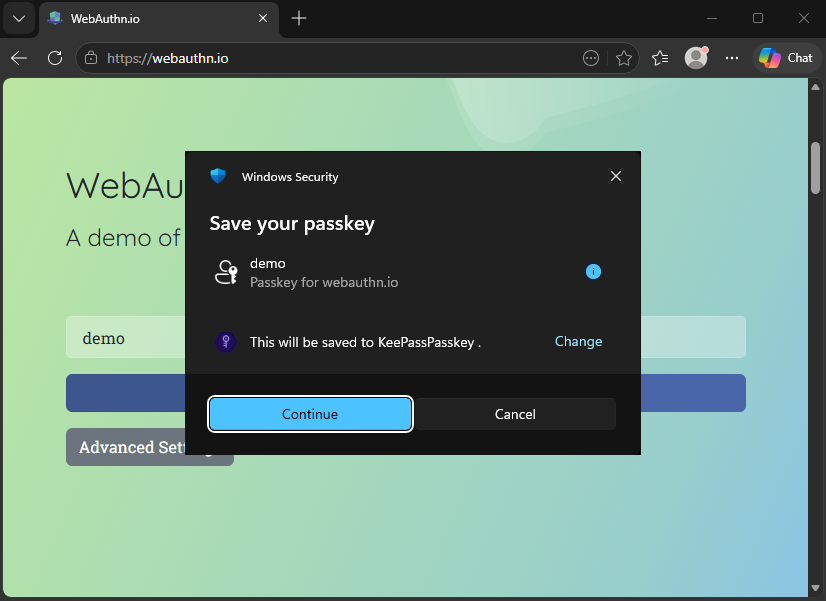
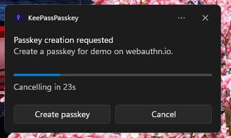
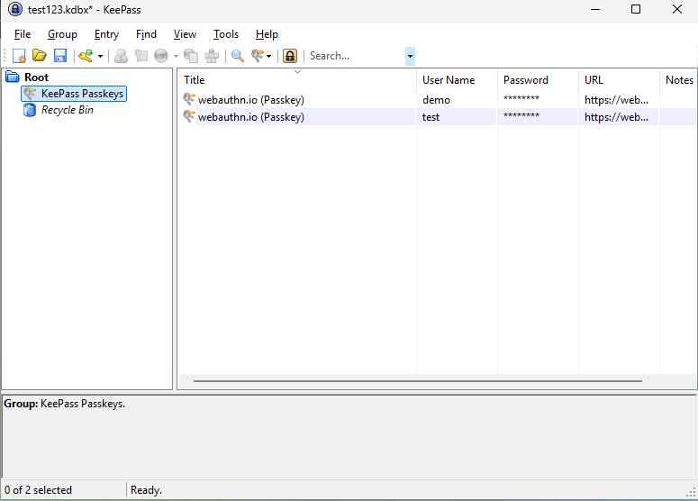
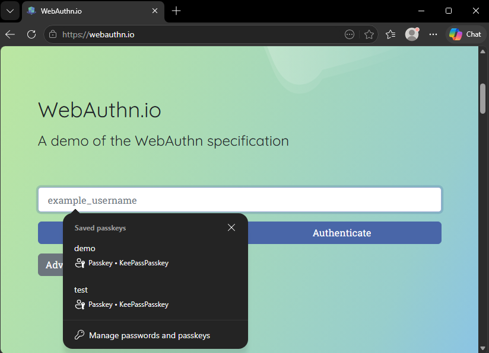
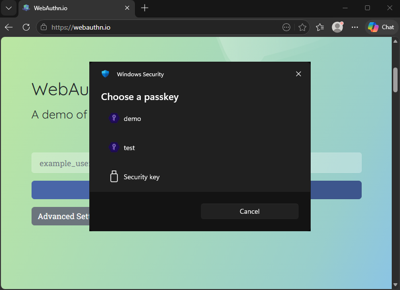
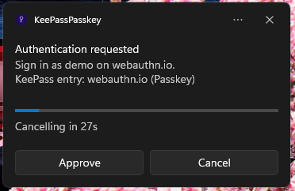

# User Guide

KeePassPasskey turns KeePass into a native Windows 11 passkey provider. Once installed, websites and apps that support passkeys will offer KeePassPasskey as a storage option, and passkeys are saved directly into your KeePass database.

## Table of Contents

- [Prerequisites](#prerequisites)
- [Installation](#installation)
- [Updates](#updates)
- [Creating a passkey](#creating-a-passkey)
- [Signing in with a passkey](#signing-in-with-a-passkey)
  - [Login with a passkey instead of a password](#login-with-a-passkey-instead-of-a-password)
  - [Login with a password and passkey as a second factor](#login-with-a-password-and-passkey-as-a-second-factor)
- [Managing passkeys in KeePass](#managing-passkeys-in-keepass)
- [Settings](#settings)
- [Troubleshooting](#troubleshooting)

## Prerequisites

- Windows 11 24H2 or later
- [KeePass](https://keepass.info/) 2.54 or later

## Installation

See the [installation instructions in the README](../README.md#installation) for the full setup steps. After installation, both status indicators in the KeePassPasskey app should show green. You can open the app at any time from the Start menu by searching for "KeePassPasskey" to check or adjust the configuration, or for debugging purposes. You do not need to keep it open: the passkey provider runs as a Windows integration in the background and is activated by Windows whenever a passkey operation is requested.

## Updates

Updates are installed the same way as a fresh installation: replace the KeePassPasskey plugin file in your KeePass plugins folder with the new version, then either run the installation script as an administrator or install the MSIX package. The KeePassPasskey passkey provider in Windows Settings remains enabled from the initial installation and does not need to be re-enabled after an update.

## Creating a passkey

When a website or app asks you to create a passkey, Windows will show a dialog to choose where to save it. KeePassPasskey may not be pre-selected. Follow the steps below.

**Step 1: Click Change to select a different provider**

Windows shows a "Saving your passkey" dialog. If KeePassPasskey is not listed as the destination, click **Change**.

**Step 2: Select KeePassPasskey**

A list of available passkey providers appears. Select **KeePassPasskey**.

**Step 3: Confirm in the KeePassPasskey notification**

A notification from KeePassPasskey appears in the taskbar. Click **Create passkey** to save the passkey to your KeePass database.

**Step 4: Passkey saved in KeePass**

The passkey is now stored as an entry in the **KeePass Passkeys** group in your open KeePass database.

## Signing in with a passkey

### Login with a passkey instead of a password

Some sites let you sign in with a passkey directly, without entering a password. The site may ask for your username first, or offer a dedicated "Sign in with a passkey" button.

**Step 1: Select your passkey from autofill or enter your username**

Click on the username field. The browser may show a list of saved passkeys as autofill suggestions. Select your passkey from the list, or enter your username and click the passkey sign-in option.

**Step 2: Select a passkey (only if multiple are saved for this site)**

If you did not use autofill and have multiple passkeys for this site, Windows shows a list. Select the one you want to use.

**Step 3: Approve in the KeePassPasskey notification**

A KeePassPasskey notification appears in the taskbar. Click **Approve** to confirm.

### Login with a password and passkey as a second factor

Some sites use a passkey as a second factor after you have entered your password.

**Step 1: Enter your username and password**

Enter your username and password as usual and submit the login form.

**Step 2: Select the passkey option as second factor**

When prompted for a second factor, select the passkey option.

**Step 3: Select a passkey (only if multiple are saved for this site)**

If you have multiple passkeys for this site, Windows shows a list. Select the one you want to use.

**Step 4: Approve in the KeePassPasskey notification**

A KeePassPasskey notification appears in the taskbar. Click **Approve** to confirm.

## Managing passkeys in KeePass

Passkeys are stored as standard KeePass entries in the **KeePass Passkeys** group.

When creating a passkey, it is saved to the currently selected KeePass database. During sign-in, KeePassPasskey searches all open databases, so you do not need to switch databases before signing in. If a passkey ends up in the wrong database, you can move it via **Entry → Data Exchange → Copy/Paste Entry**.

Passkey entries can be freely renamed or moved to any group in KeePass without affecting functionality. The **KeePass Passkeys** group itself can also be renamed. Note that if a group has searching disabled in KeePass, passkey entries inside it will not be found by KeePassPasskey. The KeePass Recycle Bin has searching disabled by default, so restoring a deleted passkey entry from there requires moving it to another group first.

To delete a passkey, delete its KeePass entry.

If multiple entries exist for the same site, KeePassPasskey uses the first one it finds during sign-in. Avoid duplicates by checking the **KeePass Passkeys** group before registering again on a site.

Passkeys created by [KeePassXC](https://keepassxc.org/) are stored in the same format and are fully compatible.

KeePassPasskey identifies an entry as a passkey by the presence of the `KPEX_PASSKEY_CREDENTIAL_ID` and `KPEX_PASSKEY_RELYING_PARTY` fields. An entry without these fields will not be recognised as a passkey, regardless of which group it is in.

Each passkey entry contains these custom fields:

| Field | Content |
|---|---|
| `KPEX_PASSKEY_CREDENTIAL_ID` | Passkey identifier |
| `KPEX_PASSKEY_PRIVATE_KEY_PEM` | Private key (keep this secret) |
| `KPEX_PASSKEY_RELYING_PARTY` | Website domain (e.g. `github.com`) |
| `KPEX_PASSKEY_USERNAME` | Username used during registration |
| `KPEX_PASSKEY_USER_HANDLE` | User identifier from the website |
| `KPEX_PASSKEY_FLAG_BE` | Backup Eligibility flag, always `1` |
| `KPEX_PASSKEY_FLAG_BS` | Backup State flag, always `1` |

## Settings

Open the KeePassPasskey app from the Start menu and navigate to **Settings**.

### User Verification

Controls how KeePassPasskey confirms your identity before completing a passkey operation.

| Option | Behavior |
|---|---|
| Notification | Shows a notification you must approve (default) |
| Windows Hello | Requires Windows Hello (PIN, fingerprint, or face) |
| Both | Requires both a notification approval and Windows Hello |
| None | No confirmation required: passkey operations complete silently |

Separate settings exist for **Registration** (creating a passkey) and **Sign-in** (using a passkey). The **Notification timeout** controls how long the notification stays open before the operation is cancelled (default: 30 seconds). This timeout only applies when the verification mode includes **Notification**.

### Notifications

**Show error notifications**: when enabled, KeePassPasskey shows a detailed notification if a passkey operation fails. Windows always shows its own generic error regardless of this setting.

### Appearance

Choose between System (follows Windows), Light, or Dark theme.

### Advanced

These settings are rarely needed. Leave them at their defaults unless you are troubleshooting.

| Setting | Description |
|---|---|
| Credential sync interval | How often passkey metadata is synced to the Windows autofill cache. Set to 0 to disable. **Be aware:** when disabled, passkeys will not appear in autofill suggestions or in the selection list when multiple passkeys exist for a site. |
| Log level | Verbosity of log files. Increase to Debug when reporting a bug. |
| Status refresh interval | How often the app polls for connection status. |
| Max credential cache sync retries | After this many sync failures the background sync pauses and resumes on the next passkey request. |

## Troubleshooting

**The KeePass plugin status indicator is not green**

- Make sure KeePass is running with a database open.
- Check that the KeePassPasskey plugin is installed: in KeePass, go to **Tools → Plugins** and verify `KeePassPasskey` appears in the list.
- If the plugin is listed but the indicator is still red, restart KeePass.

**KeePassPasskey does not appear in the provider list**

- Open the KeePassPasskey app, go to **Advanced Passkey Options** (links to Windows Settings), and make sure **KeePassPasskey** is enabled.
- If it is not listed there at all, open the KeePassPasskey app and check the status indicators for any error details. Try clicking **Unregister** followed by **Register** in the app, then check the log files for error messages if it still fails.
- Make sure Windows Hello PIN is configured. Sometimes removing and re-adding the PIN resolves the issue.

**I tried creating a passkey but it failed saying one already exists**

- KeePass already has a passkey for that site with a credential ID the website recognises. Open the **KeePass Passkeys** group, delete the existing entry for that site, and try registering again.

**Passkey prompts never show the Windows provider selection or KeePassPasskey**

- A browser extension from another password manager (such as KeePassXC-Browser or any extension with passkey support) may be intercepting passkey requests before they reach Windows. When such an extension is active, the browser hands the passkey operation directly to that extension and Windows never gets involved, so KeePassPasskey is never called.
- Disable or remove any passkey-capable browser extensions and try again. If the Windows provider selection appears afterwards, the extension was the cause.

**The notification appears but clicking Create passkey does nothing**

- Make sure a KeePass database is open. KeePassPasskey cannot save a passkey if no database is unlocked. KeePass only needs to be open during the passkey operation itself.
- If a database is open and the problem persists, check the log files for error messages.
