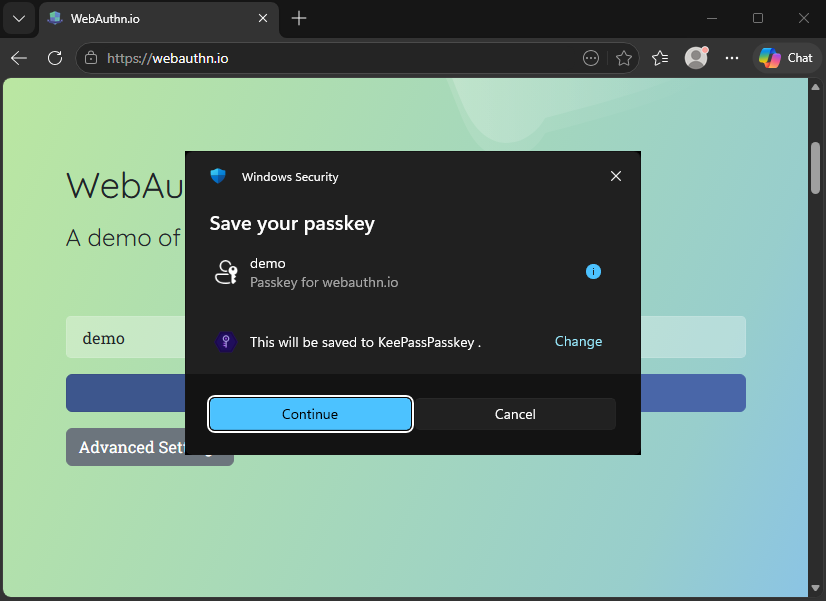
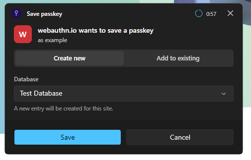
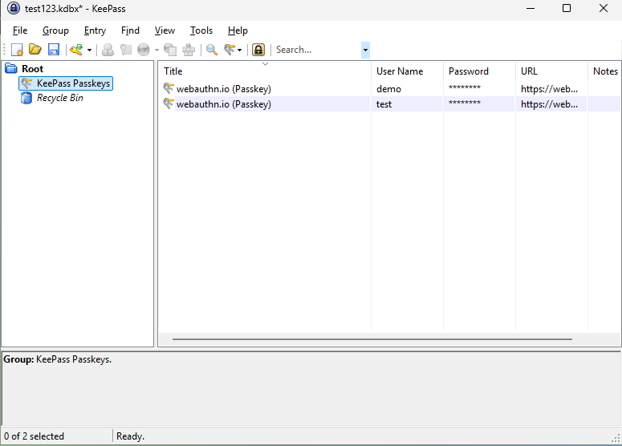
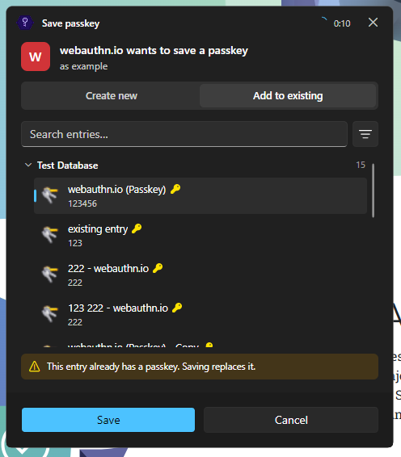
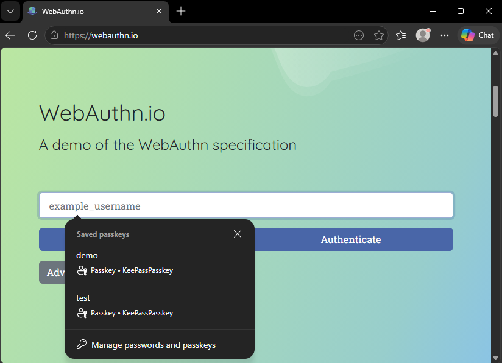
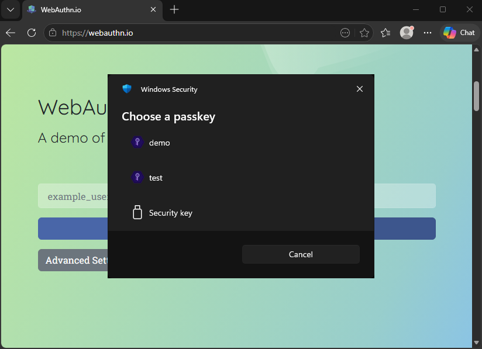
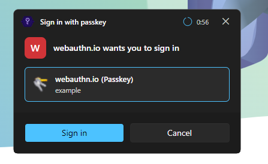

# User Guide

KeePassPasskey turns KeePass into a native Windows 11 passkey provider. Once installed, websites and apps that support passkeys will offer KeePassPasskey as a storage option, and passkeys are saved directly into your KeePass database.

## Requirements

- [KeePass](https://keepass.info/) 2.54 or later
- Windows 11 24H2 or later, with TPM[*](troubleshooting-faq.md#why-is-a-tpm-required) enabled

## Installation

See the [installation instructions in the README](../README.md#installation) for the full setup steps. After installation, both status indicators in the KeePassPasskey app should show green. You can open the app at any time from the Start menu by searching for "KeePassPasskey" to check or adjust the configuration, or for debugging purposes. You do not need to keep it open: the passkey provider runs as a Windows integration in the background and is activated by Windows whenever a passkey operation is requested.

## Updates

The app and the plugin are two separate pieces and are updated separately. The app knows which plugin version it ships, so once it has been updated, KeePass takes care of the rest.

**The plugin update prompt.** When KeePass starts and the installed KeePassPasskey app contains a newer plugin than the one loaded, a dialog offers four choices:

| Choice | What it does |
|---|---|
| Update now | Replaces the plugin file, then offers to restart KeePass so the new version is loaded |
| Later | Asks again the next time KeePass starts |
| Skip version *x.y.z* | Stays quiet until a version newer than that one appears |
| Never check for plugin updates | Turns the check off; re-enable it under [Advanced](#advanced) settings |

The dialog names the version you have, the version on offer, which installed app it comes from and the folder it will be written to. Updating a KeePass installed under `C:\Program Files\` asks for administrator rights once; portable and per-user installations update with no prompt at all. That prompt names **Windows Command Processor**, because Windows does not allow a Store app to request administrator rights for itself, so the copy is carried out by a script that ships inside the app. Expanding the prompt's details shows the script path inside the KeePassPasskey app folder. You can also trigger the check yourself from **Tools -> Check for plugin update** in KeePass.

**Microsoft Store installs** update the app automatically in the background, so the plugin prompt is usually the first sign of a new version.

**GitHub installs** update the app by running `InstallMsix.bat` as an administrator or installing the MSIX package. The plugin is then offered by the prompt above at the next KeePass start; the installer itself never writes to your KeePass plugins folder.

**Installing or removing the plugin from the app.** The app's **Install plugin...** button opens a dialog that detects your KeePass folder (you can correct it or browse for it, and its `Plugins` folder, or any folder inside it, is accepted just as well), shows exactly which file will be written where, and offers **Install**, **Update** and **Remove**. This is the route for a first installation, when no plugin is loaded yet to prompt anything.

Either way, the KeePassPasskey passkey provider in Windows Settings remains enabled from the initial installation and does not need to be re-enabled after an update.

## Creating a passkey

When a website or app asks you to create a passkey, Windows will show a dialog to choose where to save it. KeePassPasskey may not be pre-selected. Follow the steps below.

**Step 1: Click Change to select a different provider**

Windows shows a "Saving your passkey" dialog. If KeePassPasskey is not listed as the destination, click **Change**.

**Step 2: Select KeePassPasskey**

A list of available passkey providers appears. Select **KeePassPasskey**.

**Step 3: Confirm in the KeePassPasskey dialog**

A KeePassPasskey dialog appears, headed with the website's address, for example **"github.com wants to save a passkey"**. Pick the database you want to save to from the **Database** dropdown, then click **Save**. Every unlocked database is listed. **Cancel** declines the request, and so does the close button or the Escape key.

The dialog counts down in its title bar and cancels the request when it runs out (see [Approval timeout](#notifications--user-verification)).

**Step 4: Passkey saved in KeePass**

The passkey is now stored as an entry in the **Passkeys** group in your open KeePass database.

### Saving a passkey to an existing entry

If you already have an entry for the website (for example your username and password login), KeePassPasskey can save the new passkey **onto that existing entry** instead of creating a separate one, so the passkey lives next to your login.

When matching entries are found, the creation dialog shows a **Create new** / **Add to existing** switch above the database dropdown. It starts on **Create new**, so nothing changes unless you choose otherwise. Switch to **Add to existing** to see the matching entries, grouped by the database they live in, then pick one and click **Save** to write the passkey onto it.

Every matching entry is listed, however many there are. Type in the search box to narrow the list by title, username or database. The key button beside it cycles through three filters: all entries, only entries that already hold a passkey, and only entries that do not. Collapse a database group by clicking its name.

Each entry shows its KeePass icon, title and username. The entry you currently have selected in KeePass is listed first and marked with a dot; entries that already hold a passkey are marked with a key. Selecting an entry that already holds a passkey shows a warning, because saving replaces the passkey it already has.

Matching is by website: an entry qualifies when it already holds a passkey for this site, or when its **URL** field points at the same site (the same domain or a subdomain). If you overwrite an entry that already had a passkey, the previous version is kept in that entry's **History** tab so you can restore it.

This is controlled by the **Offer saving to an existing entry** setting (on by default). Turn it off to always create new entries.

## Signing in with a passkey

KeePassPasskey searches all open databases during sign-in, so you do not need to switch to a particular database first.

### Login with a passkey instead of a password

Some sites let you sign in with a passkey directly, without entering a password. The site may ask for your username first, or offer a dedicated "Sign in with a passkey" button.

**Step 1: Select your passkey from autofill or enter your username**

Click on the username field. The browser may show a list of saved passkeys as autofill suggestions. Select your passkey from the list, or enter your username and click the passkey sign-in option.

**Step 2: Select a passkey (only if multiple are saved for this site)**

If you did not use autofill and have multiple passkeys for this site, Windows shows a list. Select the one you want to use.

**Step 3: Approve in the KeePassPasskey dialog**

A KeePassPasskey dialog appears, headed with the website's address, for example **"github.com wants you to sign in"**, and showing the KeePass entry Windows picked with its icon, title, username and database. Click **Sign in** to confirm, or **Cancel** to decline.

### Login with a password and passkey as a second factor

Some sites use a passkey as a second factor after you have entered your password.

**Step 1: Enter your username and password**

Enter your username and password as usual and submit the login form.

**Step 2: Select the passkey option as second factor**

When prompted for a second factor, select the passkey option.

**Step 3: Select a passkey (only if multiple are saved for this site)**

If you have multiple passkeys for this site, Windows shows a list. Select the one you want to use.

**Step 4: Approve in the KeePassPasskey dialog**

A KeePassPasskey dialog appears, showing the KeePass entry Windows picked. Click **Sign in** to confirm.

## Managing passkeys in KeePass

Passkeys are stored as standard KeePass entries in the **Passkeys** group.

### Organising passkey entries

Passkey entries can be freely renamed or moved to any group in KeePass without affecting functionality. The **Passkeys** group itself can also be renamed.

If a group has searching disabled in KeePass, passkey entries inside it will not be found by KeePassPasskey.

If multiple entries exist for the same site, KeePassPasskey uses the first one it finds during sign-in. Avoid duplicates by checking the **Passkeys** group before registering again on a site.

### Moving or copying a passkey between entries

You can move or copy the passkey data from one entry to another, for example to attach a passkey to your existing login entry for a site, or to relocate one that was saved to the wrong entry or database. Right-click a passkey entry to open the **Passkey** submenu:

- **Cut Passkey**, then right-click the destination entry and choose **Paste Passkey Here**, moves the passkey. It is removed from the source entry only after the paste succeeds.
- **Copy Passkey**, then **Paste Passkey Here**, duplicates the passkey and leaves it on the source entry. The passkey stays on the clipboard, so you can paste it onto several entries in a row.

This works across open databases: cut or copy in one database, switch to another open database, then paste.

Both entries keep their **History**. The destination entry is backed up before the passkey is written onto it, so if it already held a passkey the previous version can be restored; when moving, the source entry is backed up before its passkey is removed. Pasting onto an entry that already has a passkey asks you to confirm the replacement first. The destination's **URL** and **User name** are filled in only when empty, so any login details you already entered there are preserved.

### Deleting a passkey

To delete a passkey, delete its KeePass entry.

To remove the passkey but keep the entry, for example an entry that also holds your password login, right-click it and choose **Passkey → Remove Passkey**. KeePassPasskey asks you to confirm, then strips the passkey fields while leaving the rest of the entry intact. The removed passkey is saved to the entry's **History** first, so you can restore it from there if you need it back.

Deleted entries move to the KeePass Recycle Bin, which has searching disabled by default, so KeePassPasskey stops finding the passkey as soon as it lands there. To restore a deleted passkey, move its entry out of the Recycle Bin into another group.

### Passkey entry format

KeePassPasskey identifies an entry as a passkey by the presence of the `KPEX_PASSKEY_CREDENTIAL_ID` and `KPEX_PASSKEY_RELYING_PARTY` fields. An entry without these fields will not be recognised as a passkey, regardless of which group it is in.

Each passkey entry contains these custom fields:

| Field | Content |
|---|---|
| `KPEX_PASSKEY_CREDENTIAL_ID` | Passkey identifier |
| `KPEX_PASSKEY_PRIVATE_KEY_PEM` | Private key (keep this secret) |
| `KPEX_PASSKEY_RELYING_PARTY` | Website domain (e.g. `github.com`) |
| `KPEX_PASSKEY_USERNAME` | Username used during registration |
| `KPEX_PASSKEY_USER_HANDLE` | User identifier from the website |
| `KPEX_PASSKEY_FLAG_BE` | Backup Eligibility flag (`1`/`0`, default `1`) |
| `KPEX_PASSKEY_FLAG_BS` | Backup State flag (`1`/`0`, default `1`) |

Passkeys created by [KeePassXC](https://keepassxc.org/) are stored in the same format and are fully compatible.

## Settings

Open the KeePassPasskey app from the Start menu and navigate to **Settings**.

### Appearance

**Theme**: choose between System (follows Windows), Light, or Dark.

**System tray icon**: when enabled, closing the window keeps the app running in the tray. The passkey provider continues to work regardless of whether the app is open.

### Notifications & User Verification

Controls how KeePassPasskey confirms your identity before completing a passkey operation. **Registration** (creating a passkey) and **Sign-in** (using a passkey) are configured separately, and each has two independent switches:

| Switch | Behavior |
|---|---|
| Windows Hello | Requires Windows Hello (PIN, fingerprint, or face) |
| Confirmation prompt | Shows a KeePassPasskey dialog you must approve |

Both are on by default. Turning both off for an operation lets it complete silently, without asking you at all; a warning icon appears beside the switches while that is the case.

The **Approval timeout** controls how long the confirmation prompt stays open before the operation is cancelled (default: 60 seconds). It only applies when the confirmation prompt is on.

**Show error notifications**: when enabled, KeePassPasskey shows a detailed notification if a passkey operation fails. Windows always shows its own generic error regardless of this setting.

### Passkey Entries

Controls how new passkey entries are created in your database.

**Save new passkeys in**: where a newly created passkey entry is placed. **Passkeys group** (default) stores it in the dedicated **Passkeys** group, which is created automatically if it does not exist. **Selected group** stores it in the group currently selected in the KeePass group tree, which is handy if you organise passkeys alongside related entries. If no group is selected, KeePassPasskey falls back to the **Passkeys** group.

**Entry title**: the title given to each new passkey entry. The default is `{RP_NAME} (Passkey)`. You can use `{RP_NAME}` for the website's display name, plus any KeePass placeholder such as `{USERNAME}`, `{URL}`, or `{S:KPEX_PASSKEY_RELYING_PARTY}`. Only unprotected fields are resolved in the title. Protected fields such as the password or private key are never exposed.

**Resolve title placeholders**: when enabled (default), placeholders are resolved when the passkey is created and the resulting text is stored as the title. When disabled, the placeholders are stored as-is so KeePass resolves them each time the entry is shown (useful if you later edit a referenced field). `{RP_NAME}` is always resolved, because it has no underlying entry field.

**Tag new passkeys**: when enabled (default), a `Passkey` tag is added to each entry created when a new passkey is registered.

**Allow duplicate passkeys**: a website can ask not to register a second passkey for an account it already has one for. This setting controls where that request is enforced:

| Option | Behaviour |
|---|---|
| Don't check | Always allow a duplicate, even when the website asks not to. |
| Check target database (default) | Block only when the existing passkey is in the database the new one would be saved to. |
| Check all databases | Block when the existing passkey is in any open database. |

Relax this if you deliberately keep the same account's passkey in more than one database and a site refuses to register it again.

### Advanced

These settings are rarely needed. Leave them at their defaults unless you are troubleshooting.

| Setting | Description |
|---|---|
| Log level | Verbosity of log files. Increase to Debug when reporting a bug, or set to Off to disable logging entirely. |
| Status refresh interval | How often the app polls for connection status. |
| Check for plugin updates | When on (default), KeePass offers to update the plugin at startup if the installed app ships a newer one. Every update is still confirmed in a dialog, nothing is replaced without your click. Turn this off to never be asked; see [Updates](#updates). |
| Offer saving to an existing entry | When on (default), passkey creation offers an **Add to existing** option so you can save the passkey onto a matching entry (by website) instead of always creating a new one. See [Saving a passkey to an existing entry](#saving-a-passkey-to-an-existing-entry). Overwriting an entry's existing passkey keeps the previous version in the entry's History. Requires the registration confirmation prompt. |
| Use legacy notification prompts | Show confirmation prompts as Windows notifications instead of dialogs, the way earlier versions did. Off by default. Notifications are silently hidden by Focus Assist and Do Not Disturb, and their database and entry pickers are limited to 5 items, so only turn this on if the dialogs cause you trouble. |

### Expert

Advanced options for uncommon setups. Leave them at their defaults unless you specifically need a different value.

#### Windows credential cache

| Setting | Description |
|---|---|
| Windows credential cache | Make your passkeys appear in the Windows sign-in prompt. **Be aware:** when off, passkeys will not appear in autofill suggestions or in the selection list, which prevents sign-in on most sites. Turning it off removes them from Windows immediately. |

Leave this **On**. It is the switch that puts your passkeys in front of Windows at all, so turning it off disables passkey sign-in almost everywhere. It is here for the rare case where you want KeePassPasskey installed but invisible to Windows.

#### Backup flags

These control the **backup flags** (`BE`/`BS`) written to newly created passkeys. **Changing them can make some websites reject the passkey.** The defaults are both **On**.

| Setting | Description |
|---|---|
| Backup Eligibility (BE) | When **On** (default), websites are told that new passkeys are allowed to be backed up and synced to your other devices. When **Off**, they are told the passkey is saved on a single device only. |
| Backup State (BS) | When **On** (default), websites are told that new passkeys are backed up right now. Only available while **Backup Eligibility** is On; turning eligibility off automatically turns this off too. |

These are the defaults for *new* passkeys. Each passkey stores its own `KPEX_PASSKEY_FLAG_BE`/`KPEX_PASSKEY_FLAG_BS` values, which are replayed on every sign-in. To change the flags on an existing passkey, edit those fields directly in the entry's **Advanced** tab in KeePass (`1` = on, `0` = off).

#### Spoof AAGUID

The **AAGUID** is a fixed identifier that tells a website which authenticator created a passkey. By default KeePassPasskey reports its own AAGUID. This setting lets you override it, for example to report a neutral all-zero value or to match another authenticator model.

To change it, type a GUID into the field and click **Apply**. Applying re-registers the authenticator with Windows with the new value. Leave the field empty and click **Apply** to go back to the built-in default. The value is saved on this device only; it is not stored in your database and does not follow the database to other machines.

| Field | Description |
|---|---|
| Spoof AAGUID | The GUID to report. Must be a valid GUID (for example `00000000-0000-0000-0000-000000000000`), or empty to use the default. |

The AAGUID is only sent when a passkey is **created**; it is never sent during sign-in, so changing it has no effect on passkeys you already have. **A few websites that enforce attestation may reject a passkey whose AAGUID they do not recognise**, so change this only if you know why you need to.

## Diagnostics

The **Diagnostics** page shows the app and plugin versions, the provider registration state, and a live view of both log files. You normally never need it; it is there for when something is not working.

### Provider registration

**Register** and **Unregister** add or remove KeePassPasskey as a passkey provider in Windows. Use them only if the app is missing from **Settings → Accounts → Passkeys → Advanced options**, or if support asks you to.

### Credential cache

To offer your passkeys in the sign-in prompt, Windows keeps its own copy of them. It is refreshed automatically whenever you open, save or close a database, or add or change a passkey, so these buttons are only needed when something looks wrong.

| Button | Description |
|---|---|
| Sync now | Refreshes the Windows copy from the databases currently open in KeePass. |
| Write to log | Writes the Windows copy and your KeePass passkeys to the log, side by side, for troubleshooting and bug reports. Usernames are not written in full. |
| Clear | Removes every passkey from the Windows copy. They come back on the next sync, so use this together with **Sync now** to rebuild it from scratch. |

If your passkeys are not offered at sign-in, see [The website says there are no passkeys on this device](troubleshooting-faq.md#the-website-says-there-are-no-passkeys-on-this-device).

## FAQ & Troubleshooting

If something is not working, the [FAQ & Troubleshooting](troubleshooting-faq.md) page covers the most common questions and fixes, such as [why a TPM is required](troubleshooting-faq.md#why-is-a-tpm-required) and [KeePassPasskey not appearing in the provider list](troubleshooting-faq.md#keepasspasskey-does-not-appear-in-the-provider-list).
